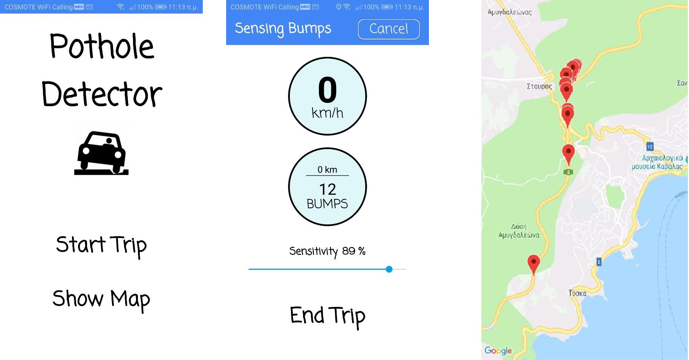
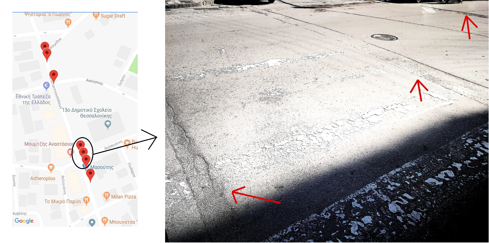
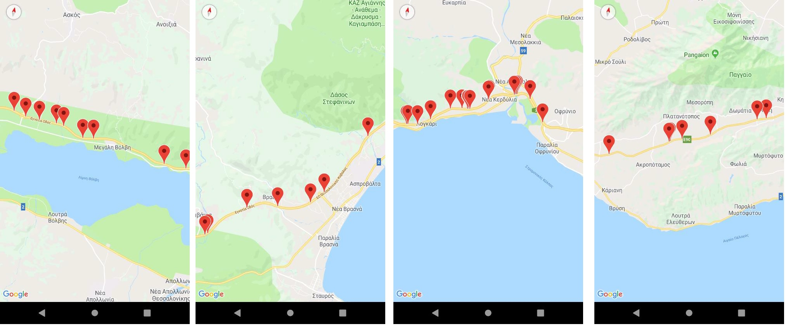

# Pothole-Detector
A smartphone app that identifies potholes created with Java in Android Studio

## Application interface
Below are some screenshots from the application interface

## Evaluation of potholes detection in a real case scenario
Image for evaluation in route 1

Image for evaluation in route 2

The results are remarkably good achieving over 90% accuracy!

**You should contact me for the source code and it is given under certain circumstances!**
